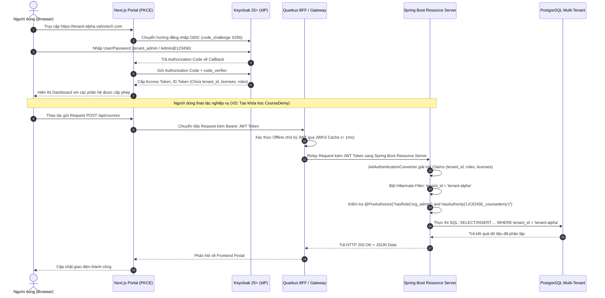

# HƯỚNG DẪN KỸ THUẬT & ĐẶC TẢ TRIỂN KHAI CHI TIẾT
## Hệ Sinh Thái SaaS Multi-Tenant Vahiztech (Spring Boot, Quarkus & Next.js)

---

## 1. KIẾN TRÚC HỆ THỐNG & LUỒNG XÁC THỰC TOÀN DIỆN

### 1.1. Sơ đồ Kiến trúc Tổng thể (System Architecture)

```mermaid
graph TB
    subgraph Client_Layer ["Tầng Giao diện Người dùng (Client Tier)"]
        Browser["Trình duyệt Người dùng<br>(Web / Mobile)"]
    end

    subgraph Identity_Layer ["Tầng Định danh & Bảo mật (IAM Tier)"]
        Keycloak["Keycloak 25.0+<br>(ecosystem-realm)<br>Feature: Organization"]
        AuthDB[("PostgreSQL 16<br>(auth-db)")]
        Keycloak --- AuthDB
    end

    subgraph Frontend_Layer ["Tầng Ứng dụng Cổng (Frontend Portal)"]
        NextPortal["Next.js 14+ App Router<br>(nextjs-portal)<br>PKCE Flow S256 | Subdomain Router"]
    end

    subgraph Gateway_BFF_Layer ["Tầng Cổng & Thời gian thực (Quarkus Gateway & BFF)"]
        QuarkusBFF["Quarkus 3.14+ Microservice<br>(GraalVM Native / SmallRye JWT)<br>- API Gateway & Data Aggregation<br>- SSE / WebSocket Real-time Hub"]
    end

    subgraph Event_Broker ["Hàng đợi Thông điệp (Event Streaming)"]
        Kafka["Apache Kafka / Redpanda<br>Topics: tenant-events, task-events, audit-logs"]
    end

    subgraph Backend_Services ["Tầng Dịch vụ Lõi (Spring Boot Resource Servers)"]
        CoursedemySVC["Coursedemy Service<br>(Spring Boot 3.3)<br>E-Learning & Video Courses"]
        VihotaskSVC["VihoTask Service<br>(Spring Boot 3.3)<br>Task & Project Management"]
        AdminSVC["Backend Admin Service<br>(Spring Boot 3.3)<br>User & Tenant Provisioning"]
        AppDB[("PostgreSQL 16<br>(Multi-Tenant DB)<br>Hibernate Filter / Schema-per-Tenant")]
    end

    Browser -->|1. Đăng nhập SSO (PKCE)| NextPortal
    NextPortal <-->|2. OIDC Code Exchange / JWKS| Keycloak
    Browser -->|3. Gọi API kèm Bearer Token| NextPortal
    NextPortal -->|4. Forward / Aggregate API| QuarkusBFF
    NextPortal -->|5. Lắng nghe Thông báo SSE| QuarkusBFF
    QuarkusBFF -->|6. REST API / JWT Token Relay| CoursedemySVC
    QuarkusBFF -->|7. REST API / JWT Token Relay| VihotaskSVC
    AdminSVC -->|8. Quản lý Org/User qua Service Account| Keycloak
    CoursedemySVC -->|Publish Events| Kafka
    VihotaskSVC -->|Publish Events| Kafka
    Kafka -->|Consume Events| QuarkusBFF
    CoursedemySVC --- AppDB
    VihotaskSVC --- AppDB
    AdminSVC --- AppDB
```

---

### 1.2. Sơ đồ Tuần tự Luồng Xác thực & Phân quyền (Sequence Flow)



---

## 2. TRIỂN KHAI SPRING BOOT RESOURCE SERVERS

### 2.1. Cấu hình Dependencies (`pom.xml`)
Các dịch vụ lõi như `coursedemy` và `vihotask` sử dụng Spring Boot 3.3+ với Java 21:

```xml
<dependencies>
    <!-- Spring Boot Web & Security -->
    <dependency>
        <groupId>org.springframework.boot</groupId>
        <artifactId>spring-boot-starter-web</artifactId>
    </dependency>
    <dependency>
        <groupId>org.springframework.boot</groupId>
        <artifactId>spring-boot-starter-security</artifactId>
    </dependency>
    <dependency>
        <groupId>org.springframework.boot</groupId>
        <artifactId>spring-boot-starter-oauth2-resource-server</artifactId>
    </dependency>

    <!-- Spring Data JPA & PostgreSQL -->
    <dependency>
        <groupId>org.springframework.boot</groupId>
        <artifactId>spring-boot-starter-data-jpa</artifactId>
    </dependency>
    <dependency>
        <groupId>org.postgresql</groupId>
        <artifactId>postgresql</artifactId>
        <scope>runtime</scope>
    </dependency>

    <!-- Keycloak Admin Client (Dùng cho Admin Service) -->
    <dependency>
        <groupId>org.keycloak</groupId>
        <artifactId>keycloak-admin-client</artifactId>
        <version>25.0.6</version>
    </dependency>

    <!-- Validation & Utilities -->
    <dependency>
        <groupId>org.springframework.boot</groupId>
        <artifactId>spring-boot-starter-validation</artifactId>
    </dependency>
    <dependency>
        <groupId>org.projectlombok</groupId>
        <artifactId>lombok</artifactId>
        <optional>true</optional>
    </dependency>
</dependencies>
```

---

### 2.2. Cấu hình Spring Security & Custom JWT Converter
Spring Boot cần bóc tách các custom claims trong token do Keycloak cấp (`tenant_id`, `licenses`, `roles`) thành Spring `GrantedAuthority`.

#### File: `SecurityConfig.java`
```java
package com.vahiztech.common.security;

import org.springframework.context.annotation.Bean;
import org.springframework.context.annotation.Configuration;
import org.springframework.core.convert.converter.Converter;
import org.springframework.security.authentication.AbstractAuthenticationToken;
import org.springframework.security.config.annotation.method.configuration.EnableMethodSecurity;
import org.springframework.security.config.annotation.web.builders.HttpSecurity;
import org.springframework.security.config.annotation.web.configuration.EnableWebSecurity;
import org.springframework.security.config.http.SessionCreationPolicy;
import org.springframework.security.core.GrantedAuthority;
import org.springframework.security.core.authority.SimpleGrantedAuthority;
import org.springframework.security.oauth2.jwt.Jwt;
import org.springframework.security.oauth2.server.resource.authentication.JwtAuthenticationToken;
import org.springframework.security.web.SecurityFilterChain;

import java.util.ArrayList;
import java.util.Collection;
import java.util.List;

@Configuration
@EnableWebSecurity
@EnableMethodSecurity(prePostEnabled = true)
public class SecurityConfig {

    @Bean
    public SecurityFilterChain securityFilterChain(HttpSecurity http) throws Exception {
        http
            .csrf(csrf -> csrf.disable())
            .sessionManagement(session -> session.sessionCreationPolicy(SessionCreationPolicy.STATELESS))
            .authorizeHttpRequests(auth -> auth
                .requestMatchers("/actuator/health", "/swagger-ui/**", "/v3/api-docs/**").permitAll()
                .anyRequest().authenticated()
            )
            .oauth2ResourceServer(oauth2 -> oauth2
                .jwt(jwt -> jwt.jwtAuthenticationConverter(customJwtAuthenticationConverter()))
            );

        return http.build();
    }

    @Bean
    public Converter<Jwt, AbstractAuthenticationToken> customJwtAuthenticationConverter() {
        return jwt -> {
            Collection<GrantedAuthority> authorities = new ArrayList<>();

            // 1. Trích xuất Roles từ Claim 'roles' (ví dụ: org_admin -> ROLE_org_admin)
            List<String> roles = jwt.getClaimAsStringList("roles");
            if (roles != null) {
                roles.forEach(role -> authorities.add(new SimpleGrantedAuthority("ROLE_" + role)));
            }

            // 2. Trích xuất Licenses từ Claim 'licenses' (ví dụ: coursedemy -> LICENSE_coursedemy)
            List<String> licenses = jwt.getClaimAsStringList("licenses");
            if (licenses != null) {
                licenses.forEach(license -> authorities.add(new SimpleGrantedAuthority("LICENSE_" + license)));
            }

            return new JwtAuthenticationToken(jwt, authorities, jwt.getClaimAsString("preferred_username"));
        };
    }
}
```

---

### 2.3. Phân lập Dữ liệu Multi-Tenant (Tenant Context & Hibernate Filter)

#### File: `TenantContext.java`
```java
package com.vahiztech.common.tenant;

public final class TenantContext {
    private static final ThreadLocal<String> CURRENT_TENANT = new ThreadLocal<>();

    private TenantContext() {}

    public static void setTenantId(String tenantId) {
        CURRENT_TENANT.set(tenantId);
    }

    public static String getTenantId() {
        return CURRENT_TENANT.get();
    }

    public static void clear() {
        CURRENT_TENANT.remove();
    }
}
```

#### File: `TenantFilterInterceptor.java`
Filter HTTP trích xuất `tenant_id` từ Token và gán vào `TenantContext`:
```java
package com.vahiztech.common.tenant;

import jakarta.servlet.*;
import jakarta.servlet.http.HttpServletRequest;
import org.springframework.security.core.context.SecurityContextHolder;
import org.springframework.security.oauth2.server.resource.authentication.JwtAuthenticationToken;
import org.springframework.stereotype.Component;

import java.io.IOException;

@Component
public class TenantFilterInterceptor implements Filter {

    @Override
    public void doFilter(ServletRequest request, ServletResponse response, FilterChain chain)
            throws IOException, ServletException {
        try {
            var auth = SecurityContextHolder.getContext().getAuthentication();
            if (auth instanceof JwtAuthenticationToken jwtAuth) {
                String tenantId = jwtAuth.getToken().getClaimAsString("tenant_id");
                if (tenantId != null && !tenantId.isBlank()) {
                    TenantContext.setTenantId(tenantId);
                }
            }
            chain.doFilter(request, response);
        } finally {
            TenantContext.clear();
        }
    }
}
```

#### File: `BaseTenantEntity.java`
Mọi Entity trong hệ thống kế thừa lớp này để tự động phân lập dữ liệu:
```java
package com.vahiztech.common.entity;

import com.vahiztech.common.tenant.TenantContext;
import jakarta.persistence.*;
import lombok.Getter;
import lombok.Setter;
import org.hibernate.annotations.Filter;
import org.hibernate.annotations.FilterDef;
import org.hibernate.annotations.ParamDef;

@MappedSuperclass
@Getter
@Setter
@FilterDef(name = "tenantFilter", parameters = @ParamDef(name = "tenantId", type = String.class))
@Filter(name = "tenantFilter", condition = "tenant_id = :tenantId")
public abstract class BaseTenantEntity {

    @Column(name = "tenant_id", nullable = false, updatable = false)
    private String tenantId;

    @PrePersist
    public void prePersist() {
        if (this.tenantId == null) {
            String currentTenant = TenantContext.getTenantId();
            if (currentTenant == null || currentTenant.isBlank()) {
                throw new IllegalStateException("Không xác định được Tenant ID cho phiên làm việc hiện tại!");
            }
            this.tenantId = currentTenant;
        }
    }
}
```

#### File: `TenantAspect.java`
Tự động kích hoạt Hibernate Filter mỗi khi mở giao dịch Database:
```java
package com.vahiztech.common.tenant;

import jakarta.persistence.EntityManager;
import org.aspectj.lang.annotation.Aspect;
import org.aspectj.lang.annotation.Before;
import org.hibernate.Session;
import org.springframework.stereotype.Component;

@Aspect
@Component
public class TenantAspect {

    private final EntityManager entityManager;

    public TenantAspect(EntityManager entityManager) {
        this.entityManager = entityManager;
    }

    @Before("execution(* com.vahiztech..repository..*(..))")
    public void applyTenantFilter() {
        String tenantId = TenantContext.getTenantId();
        if (tenantId != null && !tenantId.isBlank()) {
            Session session = entityManager.unwrap(Session.class);
            session.enableFilter("tenantFilter").setParameter("tenantId", tenantId);
        }
    }
}
```

---

### 2.4. Mẫu Business Controller được Bảo vệ (CourseDemy API)
```java
package com.vahiztech.coursedemy.controller;

import com.vahiztech.coursedemy.dto.CourseCreateRequest;
import com.vahiztech.coursedemy.dto.CourseResponse;
import com.vahiztech.coursedemy.service.CourseService;
import jakarta.validation.Valid;
import lombok.RequiredArgsConstructor;
import org.springframework.http.HttpStatus;
import org.springframework.security.access.prepost.PreAuthorize;
import org.springframework.web.bind.annotation.*;

import java.util.List;

@RestController
@RequestMapping("/api/v1/courses")
@RequiredArgsConstructor
public class CourseController {

    private final CourseService courseService;

    // Chỉ người dùng có bản quyền 'coursedemy' mới được xem danh sách
    @GetMapping
    @PreAuthorize("hasAuthority('LICENSE_coursedemy')")
    public List<CourseResponse> getAllCourses() {
        return courseService.findAllForCurrentTenant();
    }

    // Chỉ Quản trị viên của Tenant ('org_admin') VÀ có bản quyền 'coursedemy' mới được tạo khóa học
    @PostMapping
    @ResponseStatus(HttpStatus.CREATED)
    @PreAuthorize("hasRole('org_admin') and hasAuthority('LICENSE_coursedemy')")
    public CourseResponse createCourse(@Valid @RequestBody CourseCreateRequest request) {
        return courseService.createCourse(request);
    }
}
```

---

### 2.5. Tích hợp Keycloak Admin API (`backend-admin-client`)
Cấu hình Spring Boot giao tiếp Keycloak bằng Client Credentials Flow để tạo User và Organization:

```java
package com.vahiztech.admin.client;

import org.keycloak.admin.client.Keycloak;
import org.keycloak.admin.client.KeycloakBuilder;
import org.springframework.beans.factory.annotation.Value;
import org.springframework.context.annotation.Bean;
import org.springframework.context.annotation.Configuration;

@Configuration
public class KeycloakAdminConfig {

    @Value("${keycloak.server-url:http://localhost:8080}")
    private String serverUrl;

    @Value("${keycloak.realm:ecosystem-realm}")
    private String realm;

    @Value("${keycloak.client-id:backend-admin-client}")
    private String clientId;

    @Value("${keycloak.client-secret:backend_admin_secret_2026}")
    private String clientSecret;

    @Bean
    public Keycloak keycloakAdminClient() {
        return KeycloakBuilder.builder()
                .serverUrl(serverUrl)
                .realm(realm)
                .clientId(clientId)
                .clientSecret(clientSecret)
                .grantType("client_credentials")
                .build();
    }
}
```

---

## 3. TRIỂN KHAI QUARKUS MICROSERVICES (BFF & HIGH-THROUGHPUT)

### 3.1. Cấu hình `application.properties` trong Quarkus
```properties
# Quarkus HTTP Port & Root
quarkus.http.port=8082
quarkus.http.cors=true
quarkus.http.cors.origins=http://localhost:3000

# Cấu hình OIDC & SmallRye JWT với Keycloak
quarkus.oidc.auth-server-url=http://localhost:8080/realms/ecosystem-realm
quarkus.oidc.client-id=coursedemy-client
quarkus.oidc.tls.verification=none
quarkus.smallrye-jwt.enabled=true

# Apache Kafka Streaming Configuration
mp.messaging.incoming.system-events.connector=smallrye-kafka
mp.messaging.incoming.system-events.topic=tenant-events
mp.messaging.incoming.system-events.auto.offset.reset=earliest

# Biên dịch GraalVM Native Image
quarkus.package.type=native
quarkus.native.container-build=true
quarkus.native.builder-image=quay.io/quarkus/ubi-quarkus-mandrel-builder-image:jdk-21
```

---

### 3.2. Reactive BFF Endpoint Gom Dữ liệu (Mutiny & RESTEasy Reactive)
Quarkus đóng vai trò Backend-For-Frontend (BFF), đồng thời gọi CourseDemy và VihoTask một cách non-blocking:

```java
package com.vahiztech.bff.resource;

import io.smallrye.mutiny.Uni;
import io.smallrye.mutiny.tuples.Tuple2;
import jakarta.annotation.security.RolesAllowed;
import jakarta.inject.Inject;
import jakarta.ws.rs.*;
import jakarta.ws.rs.core.MediaType;
import org.eclipse.microprofile.jwt.Claim;
import org.eclipse.microprofile.jwt.JsonWebToken;

import java.util.Map;

@Path("/api/v1/bff/dashboard")
@Produces(MediaType.APPLICATION_JSON)
@Consumes(MediaType.APPLICATION_JSON)
public class DashboardBffResource {

    @Inject
    JsonWebToken jwt;

    @Inject
    @Claim("tenant_id")
    String tenantId;

    @Inject
    @Claim("licenses")
    java.util.Set<String> licenses;

    @GET
    @RolesAllowed({"org_admin", "org_member"})
    public Uni<Map<String, Object>> getAggregatedDashboardData() {
        // Gọi đồng thời 2 dịch vụ ngầm với non-blocking I/O
        Uni<String> coursedemyStats = fetchCoursedemyStats(tenantId);
        Uni<String> vihotaskStats = fetchVihotaskStats(tenantId);

        return Uni.combine().all().unis(coursedemyStats, vihotaskStats)
            .asTuple()
            .map(tuple -> Map.of(
                "tenant_id", tenantId,
                "user", jwt.getName(),
                "licenses", licenses,
                "coursedemy_summary", tuple.getItem1(),
                "vihotask_summary", tuple.getItem2()
            ));
    }

    private Uni<String> fetchCoursedemyStats(String tenantId) {
        return Uni.createFrom().item("12 Courses Active - 85 Enrolled Students");
    }

    private Uni<String> fetchVihotaskStats(String tenantId) {
        return Uni.createFrom().item("24 Tasks In Progress - 8 Completed Today");
    }
}
```

---

### 3.3. Real-time Notification Engine qua Server-Sent Events (SSE) & Kafka
Lắng nghe sự kiện từ Kafka và truyền tức thời về trình duyệt Next.js thông qua SSE:

```java
package com.vahiztech.bff.notification;

import io.smallrye.mutiny.Multi;
import io.smallrye.mutiny.operators.multi.processors.BroadcastProcessor;
import jakarta.enterprise.context.ApplicationScoped;
import jakarta.ws.rs.GET;
import jakarta.ws.rs.Path;
import jakarta.ws.rs.Produces;
import jakarta.ws.rs.core.MediaType;
import org.eclipse.microprofile.reactive.messaging.Incoming;
import org.jboss.resteasy.reactive.RestStreamElementType;

@ApplicationScoped
@Path("/api/v1/notifications")
public class NotificationResource {

    // Bộ phát quảng bá đa người nhận
    private final BroadcastProcessor<NotificationEvent> processor = BroadcastProcessor.create();

    @Incoming("system-events")
    public void consumeEvent(String eventJson) {
        NotificationEvent event = NotificationEvent.fromJson(eventJson);
        // Phát sự kiện đến tất cả các SSE client đang kết nối
        processor.onNext(event);
    }

    @GET
    @Path("/stream")
    @Produces(MediaType.SERVER_SENT_EVENTS)
    @RestStreamElementType(MediaType.APPLICATION_JSON)
    public Multi<NotificationEvent> streamNotifications() {
        return processor;
    }

    public record NotificationEvent(String tenantId, String title, String message, long timestamp) {
        public static NotificationEvent fromJson(String json) {
            return new NotificationEvent("tenant-alpha", "Cập nhật công việc", json, System.currentTimeMillis());
        }
    }
}
```

---

## 4. TRIỂN KHAI FRONTEND MULTI-TENANT PORTAL VỚI NEXT.JS

### 4.1. Cấu hình OIDC PKCE Provider trong NextAuth (`src/auth.ts`)
```typescript
import NextAuth, { NextAuthConfig } from "next-auth";
import Keycloak from "next-auth/providers/keycloak";

export const authConfig: NextAuthConfig = {
  providers: [
    Keycloak({
      clientId: process.env.KEYCLOAK_CLIENT_ID || "nextjs-portal",
      clientSecret: "", // Public Client sử dụng PKCE không cần secret
      issuer: process.env.KEYCLOAK_ISSUER || "http://localhost:8080/realms/ecosystem-realm",
    }),
  ],
  callbacks: {
    async jwt({ token, account, profile }: any) {
      if (account && profile) {
        token.accessToken = account.access_token;
        token.refreshToken = account.refresh_token;
        token.idToken = account.id_token;
        token.tenant_id = profile.tenant_id;
        token.licenses = profile.licenses || [];
        token.roles = profile.roles || [];
      }
      return token;
    },
    async session({ session, token }: any) {
      session.accessToken = token.accessToken;
      session.user.tenant_id = token.tenant_id;
      session.user.licenses = token.licenses;
      session.user.roles = token.roles;
      return session;
    },
  },
  session: { strategy: "jwt" },
};

export const { handlers, auth, signIn, signOut } = NextAuth(authConfig);
```

---

### 4.2. Edge Middleware Phân giải Subdomain & Bảo vệ Tuyến đường (`middleware.ts`)
```typescript
import { NextResponse } from "next/server";
import type { NextRequest } from "next/server";
import { auth } from "@/auth";

export async function middleware(request: NextRequest) {
  const hostname = request.headers.get("host") || "";
  const url = request.nextUrl;

  // 1. Tách Subdomain (ví dụ: tenant-alpha.vahiztech.com -> tenant-alpha)
  const currentHost = hostname.replace(`.${process.env.NEXT_PUBLIC_ROOT_DOMAIN}`, "");
  const isSubdomain = currentHost !== hostname && currentHost !== "www";

  // 2. Kiểm tra phiên đăng nhập với các trang được bảo vệ
  if (url.pathname.startsWith("/dashboard") || url.pathname.startsWith("/courses") || url.pathname.startsWith("/tasks")) {
    const session = await auth();
    if (!session?.user) {
      const loginUrl = new URL("/api/auth/signin", request.url);
      return NextResponse.redirect(loginUrl);
    }

    // Kiểm tra tính hợp lệ: Người dùng có đúng tenant của subdomain không?
    if (isSubdomain && session.user.tenant_id !== currentHost) {
      return NextResponse.rewrite(new URL("/unauthorized-tenant", request.url));
    }
  }

  // Rewrite URL theo cấu trúc Multi-tenant: /_tenants/:tenantId/...
  if (isSubdomain) {
    return NextResponse.rewrite(new URL(`/_tenants/${currentHost}${url.pathname}${url.search}`, request.url));
  }

  return NextResponse.next();
}

export const config = {
  matcher: ["/((?!api|_next/static|_next/image|favicon.ico).*)"],
};
```

---

### 4.3. Thành phần Giao diện Phân quyền Linh hoạt (`LicenseGuard.tsx`)
```tsx
"use client";

import React from "react";
import { useSession } from "next-auth/react";

interface LicenseGuardProps {
  license: "coursedemy" | "vihotask";
  fallback?: React.ReactNode;
  children: React.ReactNode;
}

export function LicenseGuard({ license, fallback, children }: LicenseGuardProps) {
  const { data: session, status } = useSession();

  if (status === "loading") {
    return <div className="p-4 text-slate-400">Đang kiểm tra bản quyền...</div>;
  }

  const userLicenses = (session?.user as any)?.licenses || [];

  if (!userLicenses.includes(license)) {
    return fallback ? (
      <>{fallback}</>
    ) : (
      <div className="rounded-lg border border-amber-500/20 bg-amber-500/10 p-4 text-amber-600">
        Tổ chức của bạn chưa kích hoạt gói tính năng <b>{license.toUpperCase()}</b>.
      </div>
    );
  }

  return <>{children}</>;
}
```

---

## 5. DOCKER CONTAINERIZATION & DOCKER-COMPOSE TỔNG THỂ

### 5.1. Dockerfile Đa Tầng cho Từng Nền Tảng

#### Spring Boot Service (Layered Distroless Dockerfile)
```dockerfile
# Build Stage
FROM maven:3.9.8-eclipse-temurin-21-alpine AS builder
WORKDIR /build
COPY pom.xml .
RUN mvn dependency:go-offline
COPY src ./src
RUN mvn clean package -DskipTests

# Runtime Stage
FROM eclipse-temurin:21-jre-alpine
WORKDIR /app
COPY --from=builder /build/target/*.jar app.jar
USER 1001
ENTRYPOINT ["java", "-XX:+UseZGC", "-XX:MaxRAMPercentage=75", "-jar", "app.jar"]
```

#### Quarkus Service (GraalVM Native Image Dockerfile)
```dockerfile
# Build Stage Native
FROM quay.io/quarkus/ubi-quarkus-mandrel-builder-image:jdk-21 AS native-builder
WORKDIR /app
COPY pom.xml .
COPY src ./src
USER root
RUN ./mvnw package -Dnative -DskipTests

# Runtime Stage Siêu Nhẹ (< 50MB)
FROM redhat/ubi9-minimal:latest
WORKDIR /app
COPY --from=native-builder /app/target/*-runner /app/application
EXPOSE 8082
USER 1001
ENTRYPOINT ["./application", "-Dquarkus.http.host=0.0.0.0"]
```

#### Next.js Portal (Standalone Output Dockerfile)
```dockerfile
FROM node:20-alpine AS base

FROM base AS deps
WORKDIR /app
COPY package.json package-lock.json ./
RUN npm ci

FROM base AS builder
WORKDIR /app
COPY --from=deps /app/node_modules ./node_modules
COPY . .
ENV NEXT_TELEMETRY_DISABLED 1
RUN npm run build

FROM base AS runner
WORKDIR /app
ENV NODE_ENV production
ENV NEXT_TELEMETRY_DISABLED 1
COPY --from=builder /app/public ./public
COPY --from=builder /app/.next/standalone ./
COPY --from=builder /app/.next/static ./.next/static
EXPOSE 3000
CMD ["node", "server.js"]
```

---

### 5.2. Docker Compose Khởi chạy Toàn bộ Hệ Sinh Thái (`docker-compose.ecosystem.yml`)

```yaml
version: '3.8'

services:
  # 1. Cơ sở dữ liệu Định danh & Ứng dụng
  postgres:
    image: postgres:16-alpine
    container_name: auth-postgres
    restart: unless-stopped
    environment:
      POSTGRES_DB: keycloak
      POSTGRES_USER: keycloak
      POSTGRES_PASSWORD: keycloak_secure_pass_2026
    volumes:
      - auth_postgres_data:/var/lib/postgresql/data
    networks:
      - vahiztech_net
    ports:
      - "5432:5432"

  # 2. Keycloak 25 IAM & SSO
  keycloak:
    image: quay.io/keycloak/keycloak:25.0.6
    container_name: auth-keycloak
    restart: unless-stopped
    depends_on:
      - postgres
    environment:
      KC_DB: postgres
      KC_DB_URL: jdbc:postgresql://postgres:5432/keycloak
      KC_DB_USERNAME: keycloak
      KC_DB_PASSWORD: keycloak_secure_pass_2026
      KEYCLOAK_ADMIN: admin
      KEYCLOAK_ADMIN_PASSWORD: admin_master_password_2026
      KC_HTTP_ENABLED: "true"
      KC_HOSTNAME_STRICT: "false"
      KC_FEATURES: "organization"
    command: ["start-dev", "--import-realm"]
    ports:
      - "8080:8080"
    volumes:
      - ./realm-config.json:/opt/keycloak/data/import/realm-config.json:ro
    networks:
      - vahiztech_net

  # 3. Apache Kafka Message Broker
  kafka:
    image: confluentinc/cp-kafka:7.6.1
    container_name: auth-kafka
    environment:
      KAFKA_NODE_ID: 1
      KAFKA_LISTENER_SECURITY_PROTOCOL_MAP: 'CONTROLLER:PLAINTEXT,PLAINTEXT:PLAINTEXT,PLAINTEXT_HOST:PLAINTEXT'
      KAFKA_ADVERTISED_LISTENERS: 'PLAINTEXT://kafka:9092,PLAINTEXT_HOST://localhost:29092'
      KAFKA_OFFSETS_TOPIC_REPLICATION_FACTOR: 1
      KAFKA_PROCESS_ROLES: 'broker,controller'
      KAFKA_CONTROLLER_QUORUM_VOTERS: '1@kafka:29093'
      KAFKA_LISTENERS: 'PLAINTEXT://0.0.0.0:9092,CONTROLLER://0.0.0.0:29093,PLAINTEXT_HOST://0.0.0.0:29092'
      KAFKA_INTER_BROKER_LISTENER_NAME: 'PLAINTEXT'
      KAFKA_CONTROLLER_LISTENER_NAMES: 'CONTROLLER'
      CLUSTER_ID: '4L622nShTUiTWhAQdialog'
    ports:
      - "29092:29092"
    networks:
      - vahiztech_net

  # 4. Quarkus BFF & Real-time Notification Gateway
  quarkus-bff:
    build:
      context: ./apps/quarkus-bff
      dockerfile: Dockerfile
    container_name: vahiztech-quarkus-bff
    depends_on:
      - keycloak
      - kafka
    environment:
      QUARKUS_OIDC_AUTH_SERVER_URL: http://keycloak:8080/realms/ecosystem-realm
      MP_MESSAGING_INCOMING_SYSTEM_EVENTS_BOOTSTRAP_SERVERS: kafka:9092
    ports:
      - "8082:8082"
    networks:
      - vahiztech_net

  # 5. Spring Boot Core Service (CourseDemy)
  coursedemy-service:
    build:
      context: ./apps/coursedemy
      dockerfile: Dockerfile
    container_name: vahiztech-coursedemy
    depends_on:
      - postgres
      - keycloak
    environment:
      SPRING_SECURITY_OAUTH2_RESOURCESERVER_JWT_JWK_SET_URI: http://keycloak:8080/realms/ecosystem-realm/protocol/openid-connect/certs
      SPRING_DATASOURCE_URL: jdbc:postgresql://postgres:5432/keycloak
    ports:
      - "8081:8081"
    networks:
      - vahiztech_net

  # 6. Next.js Portal Frontend
  nextjs-portal:
    build:
      context: ./apps/nextjs-portal
      dockerfile: Dockerfile
    container_name: vahiztech-nextjs-portal
    depends_on:
      - keycloak
      - quarkus-bff
    environment:
      KEYCLOAK_ISSUER: http://keycloak:8080/realms/ecosystem-realm
      KEYCLOAK_CLIENT_ID: nextjs-portal
      NEXT_PUBLIC_QUARKUS_BFF_URL: http://localhost:8082
    ports:
      - "3000:3000"
    networks:
      - vahiztech_net

networks:
  vahiztech_net:
    name: vahiztech_net
    driver: bridge

volumes:
  auth_postgres_data:
    name: auth_postgres_data
```
