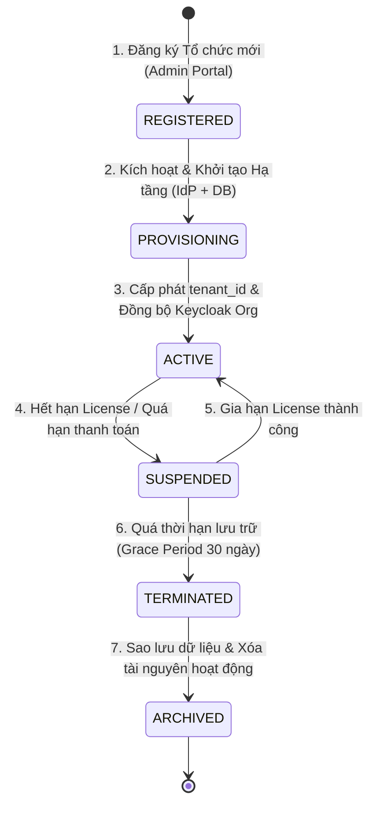
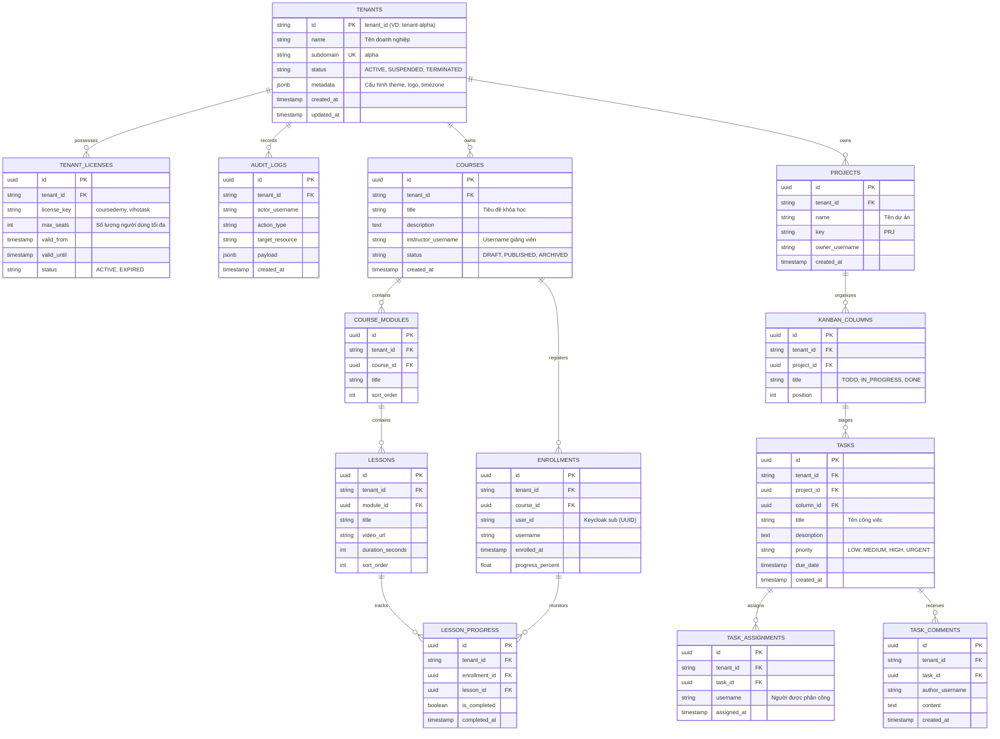

# ĐẶC TẢ KIẾN TRÚC & MÔ HÌNH DỮ LIỆU MULTI-TENANT (PHASE 1)
## Hệ Sinh Thái SaaS Vahiztech - Kiến Trúc Đa Người Thuê, Bảo Mật & Toàn Vẹn Dữ Liệu

---

## 1. KHẢO SÁT NGHIỆP VỤ & MÔ HÌNH TỔ CHỨC SAAS

### 1.1. Bối cảnh Nghiệp vụ B2B & B2C
Hệ sinh thái **Vahiztech** phục vụ đồng thời hai mô hình khách hàng chính:
1. **Khách hàng Doanh nghiệp / Tổ chức (B2B SaaS - Multi-Tenant)**:
   - Mỗi doanh nghiệp là một **Tenant** riêng biệt (ví dụ: `tenant-alpha`, `tenant-beta`).
   - Mỗi Tenant có định danh duy nhất (`tenant_id`), tên miền phụ riêng biệt (ví dụ: `alpha.vahiztech.com`), cấu hình nhận diện thương hiệu (Branding/Theme), danh sách người dùng thuộc quyền quản lý và gói dịch vụ bản quyền đã mua (`licenses`).
2. **Khách hàng Cá nhân (B2C - Individual Users)**:
   - Người dùng tự do đăng ký tài khoản trực tiếp trên cổng thông tin chung.
   - Trực thuộc một Tenant mặc định (`tenant-public` hoặc `individual_user`) với phạm vi quyền hạn cá nhân hóa.

---

### 1.2. Vòng đời Tổ chức & Khách hàng (Tenant Lifecycle)



#### Các trạng thái trong vòng đời:
- **`REGISTERED`**: Khách hàng điền thông tin đăng ký tổ chức, chọn gói sản phẩm (`coursedemy`, `vihotask`).
- **`PROVISIONING`**: Hệ thống Core Admin Service gọi Keycloak Admin REST API tạo Organization, tạo Quản trị viên Tenant (`org_admin`), gán claims `tenant_id` và `licenses`. Đồng thời khởi tạo dữ liệu mặc định (seed data) trong Database.
- **`ACTIVE`**: Tenant hoạt động bình thường, các thành viên được cấp quyền truy cập các sản phẩm theo gói license.
- **`SUSPENDED`**: Tạm khóa truy cập khi quá hạn gói bản quyền; chỉ cho phép `org_admin` đăng nhập để gia hạn.
- **`TERMINATED / ARCHIVED`**: Ngừng cung cấp dịch vụ, đóng băng dữ liệu hoặc trích xuất bản sao lưu cho khách hàng.

---

## 2. MA TRẬN PHÂN QUYỀN TOÀN DIỆN (RBAC & ABAC)

Hệ thống áp dụng mô hình phân quyền kép kết hợp giữa **Vai trò (Role-Based Access Control - RBAC)** và **Thuộc tính Bản quyền (Attribute-Based Access Control - ABAC)**:
- **RBAC**: Xác định cấp bậc quyền hạn trong tổ chức (`org_admin`, `org_member`, `individual_user`).
- **ABAC**: Xác định quyền truy cập vào từng sản phẩm số thông qua danh sách `licenses` (`["coursedemy", "vihotask"]`).

### Ma trận Phân quyền Chức năng:

| Nhóm Chức năng / Hành vi | `org_admin` + `coursedemy` | `org_member` + `coursedemy` | `org_admin` + `vihotask` | `org_member` + `vihotask` | `individual_user` |
| :--- | :---: | :---: | :---: | :---: | :---: |
| **Quản trị Tổ chức & Thành viên** | ✅ Toàn quyền | ❌ Không | ✅ Toàn quyền | ❌ Không | ❌ Không |
| **Gia hạn / Nâng cấp Gói License** | ✅ Có | ❌ Không | ✅ Có | ❌ Không | ❌ Không |
| **Tạo / Sửa / Xóa Khóa học** | ✅ Toàn quyền | ❌ Chỉ xem/học | ❌ Không có license | ❌ Không có license | ❌ Chỉ xem/học |
| **Ghi danh & Xem Tiến độ Học viên** | ✅ Toàn bộ Tenant | ❌ Chỉ bản thân | ❌ Không có license | ❌ Không có license | ❌ Chỉ bản thân |
| **Tạo & Quản trị Dự án / Kanban** | ❌ Không có license | ❌ Không có license | ✅ Toàn quyền | ❌ Chỉ trong dự án | ❌ Dự án cá nhân |
| **Tạo / Di chuyển / Đóng Task** | ❌ Không có license | ❌ Không có license | ✅ Toàn quyền | ✅ Dự án tham gia | ✅ Dự án cá nhân |
| **Xem Báo cáo Tổng hợp (BFF Dashboard)** | ✅ Toàn bộ Tenant | ❌ Dữ liệu cá nhân | ✅ Toàn bộ Tenant | ❌ Dữ liệu cá nhân | ❌ Dữ liệu cá nhân |

---

## 3. CHIẾN LƯỢC PHÂN LẬP DỮ LIỆU MULTI-TENANCY (DATA ISOLATION)

Để cân bằng giữa **chi phí hạ tầng, khả năng mở rộng (Scalability)** và **mức độ an toàn thông tin (Security)**, Vahiztech áp dụng chiến lược **Bảo vệ Hai Lớp (Defense-in-Depth)**:

```
[Layer 1: Application Security]  Spring Security & Quarkus SmallRye JWT (Xác thực Claim tenant_id)
             |
             v
[Layer 2: ORM Data Filtering]    Hibernate Filter (@Filter) tự động chèn: WHERE tenant_id = :tenantId
             |
             v
[Layer 3: Database Security]     PostgreSQL 16 Row-Level Security (RLS) cưỡng chế phân lập ở tầng Engine
```

### 3.1. Phân loại Chiến lược Phân lập

1. **Gói Tiêu chuẩn (Standard / Multi-Tenant Shared DB)**:
   - Áp dụng cho đa số khách hàng SMB và B2C.
   - Dùng chung một cơ sở dữ liệu và bảng vật lý, mọi bảng đều có cột bắt buộc: `tenant_id VARCHAR(64) NOT NULL`.
   - Kết hợp chỉ mục tổng hợp (Composite Index): `CREATE INDEX idx_... ON table (tenant_id, id)`.
   - Bật PostgreSQL Row-Level Security (RLS) để ngăn chặn rò rỉ ngay cả khi lập trình viên quên mệnh đề `WHERE`.

2. **Gói Doanh nghiệp Cao cấp (Enterprise / Schema-per-Tenant)**:
   - Dành cho các tập đoàn yêu cầu tuân thủ chuẩn bảo mật riêng biệt (SOC2, HIPAA, GDPR).
   - Mỗi Tenant sở hữu một Database Schema riêng biệt (ví dụ: `schema_tenant_alpha`, `schema_tenant_beta`).
   - Tầng ứng dụng sử dụng Spring Boot `MultiTenantConnectionProvider` để định tuyến DataSource động dựa theo `TenantContext`.

---

## 4. SƠ ĐỒ THỰC THỂ LIÊN KẾT DỮ LIỆU (DATABASE ERD)



---

## 5. TỪ ĐIỂN DỮ LIỆU (DATA DICTIONARY)

### 5.1. Bảng `tenants` (Quản trị Tổ chức)
| Tên Cột | Kiểu Dữ Liệu | Ràng Buộc | Ý Nghĩa |
| :--- | :--- | :--- | :--- |
| `id` | `VARCHAR(64)` | `PRIMARY KEY` | Định danh Tenant (trùng với Keycloak Org / Tenant ID). |
| `name` | `VARCHAR(255)` | `NOT NULL` | Tên công ty / tổ chức đăng ký. |
| `subdomain` | `VARCHAR(100)` | `UNIQUE, NOT NULL` | Tiền tố tên miền phụ (VD: `alpha` trong `alpha.vahiztech.com`). |
| `status` | `VARCHAR(32)` | `NOT NULL, DEFAULT 'ACTIVE'` | Trạng thái hoạt động: `ACTIVE`, `SUSPENDED`, `TERMINATED`. |
| `metadata` | `JSONB` | `DEFAULT '{}'` | Tùy biến: logo URL, primary color, cài đặt ngôn ngữ. |
| `created_at` | `TIMESTAMP WITH TIME ZONE` | `DEFAULT CURRENT_TIMESTAMP` | Thời điểm tạo bản ghi. |
| `updated_at` | `TIMESTAMP WITH TIME ZONE` | `DEFAULT CURRENT_TIMESTAMP` | Thời điểm cập nhật cuối. |

### 5.2. Bảng `tenant_licenses` (Quản lý Bản quyền Sản phẩm)
| Tên Cột | Kiểu Dữ Liệu | Ràng Buộc | Ý Nghĩa |
| :--- | :--- | :--- | :--- |
| `id` | `UUID` | `PRIMARY KEY, DEFAULT gen_random_uuid()` | Khóa chính ngẫu nhiên. |
| `tenant_id` | `VARCHAR(64)` | `REFERENCES tenants(id) ON DELETE CASCADE` | Thuộc về tổ chức nào. |
| `license_key` | `VARCHAR(64)` | `NOT NULL` | Mã bản quyền: `coursedemy`, `vihotask`. |
| `max_seats` | `INTEGER` | `NOT NULL, DEFAULT 5` | Giới hạn số lượng thành viên được gán license. |
| `valid_from` | `TIMESTAMP WITH TIME ZONE` | `NOT NULL` | Ngày bắt đầu hiệu lực. |
| `valid_until` | `TIMESTAMP WITH TIME ZONE` | `NOT NULL` | Ngày hết hạn giấy phép. |
| `status` | `VARCHAR(32)` | `NOT NULL, DEFAULT 'ACTIVE'` | `ACTIVE`, `EXPIRED`, `REVOKED`. |

### 5.3. Bảng `courses` (CourseDemy Domain)
| Tên Cột | Kiểu Dữ Liệu | Ràng Buộc | Ý Nghĩa |
| :--- | :--- | :--- | :--- |
| `id` | `UUID` | `PRIMARY KEY, DEFAULT gen_random_uuid()` | Khóa chính khóa học. |
| `tenant_id` | `VARCHAR(64)` | `NOT NULL, INDEX` | Mã Tenant sở hữu khóa học. |
| `title` | `VARCHAR(255)` | `NOT NULL` | Tên khóa học. |
| `slug` | `VARCHAR(255)` | `NOT NULL` | Đường dẫn thân thiện SEO. |
| `description` | `TEXT` | - | Nội dung tóm tắt chi tiết. |
| `instructor_username` | `VARCHAR(100)` | `NOT NULL` | Username người giảng dạy. |
| `status` | `VARCHAR(32)` | `DEFAULT 'DRAFT'` | `DRAFT`, `PUBLISHED`, `ARCHIVED`. |
| `created_at` | `TIMESTAMP WITH TIME ZONE` | `DEFAULT CURRENT_TIMESTAMP` | Thời gian tạo khóa học. |

### 5.4. Bảng `tasks` (VihoTask Domain)
| Tên Cột | Kiểu Dữ Liệu | Ràng Buộc | Ý Nghĩa |
| :--- | :--- | :--- | :--- |
| `id` | `UUID` | `PRIMARY KEY, DEFAULT gen_random_uuid()` | Khóa chính công việc. |
| `tenant_id` | `VARCHAR(64)` | `NOT NULL, INDEX` | Mã Tenant sở hữu công việc. |
| `project_id` | `UUID` | `REFERENCES projects(id) ON DELETE CASCADE` | Thuộc về dự án nào. |
| `column_id` | `UUID` | `REFERENCES kanban_columns(id)` | Nằm ở cột Kanban nào (TODO/IN_PROGRESS/DONE). |
| `title` | `VARCHAR(255)` | `NOT NULL` | Tiêu đề công việc. |
| `description` | `TEXT` | - | Chi tiết yêu cầu công việc. |
| `priority` | `VARCHAR(32)` | `DEFAULT 'MEDIUM'` | Mức độ ưu tiên: `LOW`, `MEDIUM`, `HIGH`, `URGENT`. |
| `due_date` | `TIMESTAMP WITH TIME ZONE` | - | Hạn hoàn thành. |
| `created_at` | `TIMESTAMP WITH TIME ZONE` | `DEFAULT CURRENT_TIMESTAMP` | Thời điểm tạo công việc. |

---

## 6. QUY TẮC PHÂN LẬP & TỐI ƯU TRUY VẤN (QUERY OPTIMIZATION)

1. **Bắt buộc Index Composite**:
   Mọi bảng có chứa dữ liệu phân lập đều phải được tạo Composite B-Tree Index bắt đầu bằng `tenant_id`:
   ```sql
   CREATE INDEX idx_courses_tenant_status ON courses (tenant_id, status);
   CREATE INDEX idx_tasks_tenant_project ON tasks (tenant_id, project_id, column_id);
   ```
2. **Quy tắc Khóa ngoại (Foreign Keys)**:
   Mọi liên kết cha - con (ví dụ: `tasks` thuộc `projects`) đều phải cùng thuộc về 1 `tenant_id`. Database Trigger hoặc Constraint sẽ kiểm tra chéo tính toàn vẹn để tránh liên kết chéo dữ liệu giữa các Tenant.
3. **Cơ chế Row-Level Security (RLS)**:
   Thiết lập biến phiên PostgreSQL: `SET LOCAL app.current_tenant_id = 'tenant-alpha';` trước khi chạy các câu lệnh SQL, đảm bảo ngay cả các câu truy vấn thô (Native SQL) cũng không thể nhìn thấy dữ liệu của tenant khác.
